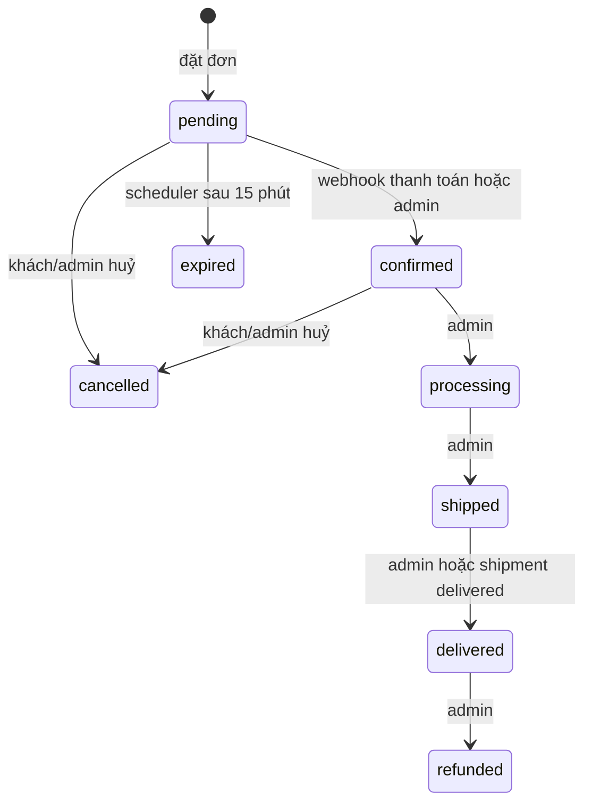

# Orders lifecycle

Tài liệu này là điểm vào cho nghiệp vụ Orders ở backend. Dùng nó trước khi thêm trạng thái, payment provider, shipping provider hoặc thay đổi tồn kho.

## Phạm vi

- `Order` là đơn bán cho khách.
- `Shipment` là vận đơn gắn với một order.
- Nhập hàng, bổ sung tồn kho và purchase order là module khác; không mở rộng `Order` để xử lý các nghiệp vụ đó.

## Quy ước đọc tài liệu

- **Hiện tại**: hành vi đang được code thực thi.
- **Mục tiêu**: rule nghiệp vụ nên được triển khai trước khi dùng luồng tương ứng ở production.
- `Order` là đơn bán; `Shipment` là vận đơn/tiến độ carrier; `Payment` là giao dịch tiền. Ba đối tượng không phải một state machine duy nhất.

## Bản đồ luồng hiện tại

```mermaid
flowchart LR
  A[POST /api/orders] --> B[PlaceOrderUseCase]
  B --> C[Order: pending]
  B --> D[Trừ tồn kho]
  B --> E[Xoá giỏ]
  F[SePay webhook] --> G[HandlePaymentWebhookUseCase]
  G --> H[Order: confirmed]
  H --> I[POST admin orders/{id}/shipment]
  I --> J[Shipment: ready_to_pick]
  K[Shipping webhook] --> L[Shipment cập nhật trạng thái]
  L -->|delivered| M[Order: delivered]
```

## State machine hiện tại

### Order



| Trạng thái | Ý nghĩa hiện tại | Được chuyển từ |
| --- | --- | --- |
| `pending` | Đơn mới tạo, đang chờ xác nhận/thanh toán | tạo order |
| `confirmed` | Đơn đã được xác nhận | `pending` |
| `processing` | Shop đang xử lý | `confirmed` |
| `shipped` | Đã bàn giao/giao hàng | `processing` |
| `delivered` | Giao thành công | `shipped` |
| `cancelled` | Đơn bị huỷ | `pending`, `confirmed` |
| `expired` | `pending` quá 15 phút | scheduler |
| `refunded` | Đã hoàn tiền theo thao tác admin | `delivered` |

`UpdateOrderStatusUseCase` chỉ cho phép các transition trong sơ đồ, trừ `expired` được scheduler cập nhật trực tiếp ở repository.

### Shipment

Shipment có state machine riêng: `ready_to_pick -> picked -> ... -> delivered`, kèm các nhánh `cancel`, giao thất bại và hoàn hàng. Chỉ event `delivered` hiện đồng bộ Order sang trạng thái `delivered`.

## Bảng side effects — nguồn kiểm tra chính

| Sự kiện | Order | Payment | Shipment | Tồn kho | Hiện tại |
| --- | --- | --- | --- | --- | --- |
| Khách đặt đơn | `pending` | chưa có transaction | chưa tạo | trừ ngay | Đã có |
| Webhook SePay hợp lệ, đủ tiền | `pending -> confirmed` | lưu `paid` | chưa tạo | giữ nguyên | Đã có |
| Webhook SePay sai tiền/chiều tiền | không đổi | lưu `mismatch` | không đổi | giữ nguyên | Đã có |
| Webhook SePay trùng | không đổi | bỏ qua | không đổi | không đổi | Đã có |
| Admin tạo shipment | không đổi | không đổi | `ready_to_pick` | không đổi | Đã có |
| Carrier báo đang giao | không đổi | không đổi | in-transit | không đổi | Đã có; Order chưa phản ánh |
| Carrier báo giao thành công | đi đến `delivered` | không đổi | `delivered` | không đổi | Đã có |
| Khách huỷ `pending/confirmed` | `cancelled` | không đổi | không đổi | **chưa hoàn** | Khoảng trống |
| Pending quá 15 phút | `expired` | không đổi | không đổi | **chưa hoàn** | Khoảng trống |
| Hoàn tiền | `refunded` | chưa có refund transaction | không đổi | chưa xác định | Khoảng trống |

## Invariants phải giữ

Đây là các rule dùng để review code và viết test. Chúng mô tả mục tiêu nghiệp vụ; các rule đánh dấu chưa có nghĩa là hiện chưa được code bảo đảm.

1. Một đơn chỉ reserve, release hoặc deduct tồn kho **một lần** cho mỗi item.
2. Không được xác nhận thanh toán cho order `cancelled` hoặc `expired`.
3. Không được cho một order có shipment đang hoạt động thành `cancelled` mà không xử lý carrier shipment.
4. `finalAmount`, item price và địa chỉ giao hàng là snapshot của thời điểm đặt đơn; không tính lại theo dữ liệu catalog hiện tại.
5. Mỗi webhook phải idempotent; cùng provider reference/event không tạo thêm payment hoặc làm order chuyển trạng thái lần nữa.
6. Không được oversell khi có hai checkout đồng thời.
7. Promotion phải được validate, tính tiền và tiêu quota atomically với việc tạo/reserve order.

## Khoảng trống cần nhớ trước khi mở rộng

### Tồn kho

Hiện tại `PlaceOrderUseCase` kiểm tra tồn rồi trừ ngay. `CancelOrderUseCase` và `ExpirePendingOrdersUseCase` chỉ đổi status, không hoàn tồn. Cần chốt một trong hai policy:

- **Reservation khi tạo order**: reserve ngay, release khi `cancelled/expired`, deduct chính thức khi thanh toán hoặc hoàn tất.
- **Deduct sau payment**: không trừ khi tạo đơn online; chỉ atomic deduct khi payment được xác nhận.

Không nên trộn hai policy.

### Payment method

Tất cả payment method hiện bắt đầu bằng `pending`; scheduler expire mọi `pending` sau 15 phút. Khi cần hỗ trợ COD nghiêm túc, tách nghĩa của trạng thái:

```text
paymentStatus: pending | paid | failed | refunded
orderStatus: pending_confirmation | confirmed | cancelled | completed
fulfillmentStatus: unfulfilled | processing | shipped | delivered | returned
```

Hoặc tối thiểu chỉ expire payment method online.

### Promotion

`promotionCode` hiện chỉ được lưu vào order. `ValidatePromotionUseCase` không được gọi từ `PlaceOrderUseCase`; vì vậy discount, điều kiện tối thiểu và quota chưa ảnh hưởng đến đơn.

### Shipment cancellation và refund

Order `confirmed` vẫn có thể huỷ sau khi tạo vận đơn. Trước khi cho phép điều này ở production, cần tích hợp carrier cancellation hoặc chặn huỷ khi shipment đã active. `refunded` hiện là state transition, chưa phải quy trình hoàn tiền qua payment provider.

## Điểm vào trong code

| Nghiệp vụ | Controller / use case |
| --- | --- |
| Tạo, xem, huỷ order của khách | `application/order/controller/OrderController` |
| Vận hành order và tạo shipment | `application/order/controller/AdminOrderController` |
| Tạo order, trừ tồn, xoá giỏ | `domain/order/usecase/PlaceOrderUseCase` |
| Huỷ order | `domain/order/usecase/CancelOrderUseCase` |
| Chuyển trạng thái order | `domain/order/usecase/UpdateOrderStatusUseCase` |
| Expire đơn pending | `domain/order/usecase/ExpirePendingOrdersUseCase`, `infrastructure/scheduler/OrderExpiryScheduler` |
| Payment webhook | `application/payment/controller/PaymentWebhookController`, `domain/payment/usecase/HandlePaymentWebhookUseCase` |
| Shipping webhook | `application/shipping/controller/ShippingWebhookController`, `domain/shipping/usecase/HandleShippingWebhookUseCase` |
| Đồng bộ shipment delivered sang order | `domain/shipping/service/ShipmentOrderStatusSyncService` |

Khi lần đầu đọc module, đi theo thứ tự: controller order → `PlaceOrderUseCase` → `UpdateOrderStatusUseCase` → `CreateShipmentUseCase` → shipping webhook → `ShipmentOrderStatusSyncService`.

## Checklist khi thay đổi Orders

- [ ] Transition mới có được thêm vào state machine và test không?
- [ ] Nó ảnh hưởng gì đến inventory: reserve, release hay deduct?
- [ ] Nó ảnh hưởng gì đến payment và refund?
- [ ] Nó có cần gọi/cập nhật shipment hoặc carrier không?
- [ ] Webhook/event lặp lại có an toàn không?
- [ ] Đơn terminal (`cancelled`, `expired`, `refunded`) có bị chuyển sai không?
- [ ] Snapshot số tiền, item, địa chỉ có còn bất biến không?
- [ ] API docs và file này đã được cập nhật chưa?

## Lệnh kiểm chứng

```powershell
cd nitrotech-api
.\gradlew.bat test
```

Các unit test hiện có bao phủ đặt đơn cơ bản, huỷ, state transition, expiry, payment webhook, shipment và shipping webhook. Khi hiện thực các khoảng trống trên, thêm test đúng side effect tương ứng vào bảng này.
