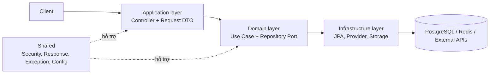
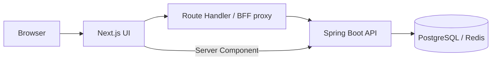
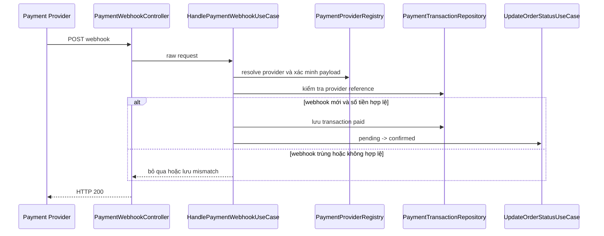

# Báo cáo kỹ thuật đồ án NitroTech

## 1. Bối cảnh và mục tiêu

NitroTech là hệ thống thương mại điện tử cho nhóm sản phẩm công nghệ, gồm storefront cho khách hàng và dashboard cho nhân viên vận hành. Phạm vi nghiệp vụ gồm tài khoản, catalog có biến thể, giỏ hàng, tồn kho, đơn hàng, thanh toán, vận chuyển, media, khuyến mãi và quản trị dữ liệu.

Mục tiêu kỹ thuật của đồ án là xây dựng một hệ thống có thể duy trì các bất biến nghiệp vụ liên module: giá và tồn kho thuộc variant, địa chỉ của order là snapshot, webhook có thể lặp lại, nhân viên chỉ thực hiện thao tác đúng quyền, và database có lịch sử thay đổi tái lập được. Vì vậy, các quyết định kiến trúc tập trung vào tính đúng đắn của nghiệp vụ và kiểm soát độ phức tạp cấu trúc.

## 2. Lựa chọn kiến trúc

### 2.1. Spring MVC kết hợp Use Case thay vì triển khai controller-centric

NitroTech vẫn sử dụng Spring MVC ở tầng HTTP. Điểm khác biệt là dự án không đặt các quy tắc nghiệp vụ trọng yếu trực tiếp trong controller. Controller chịu trách nhiệm nhận request, validate dữ liệu, ánh xạ request sang command và trả response; Use Case thuộc domain layer thực hiện nghiệp vụ.

| Phương án | Ưu điểm | Hạn chế | Lựa chọn của dự án |
| --- | --- | --- | --- |
| Controller-centric | Khởi tạo nhanh cho CRUD đơn giản | Dễ phát sinh Fat Controller; quy tắc nghiệp vụ phụ thuộc HTTP context | Không dùng cho nghiệp vụ trọng yếu |
| Service tổng quát | Phổ biến, dễ tiếp cận | Dễ tạo lớp lớn chứa nhiều trách nhiệm, ví dụ `OrderService` | Chỉ dùng cho tác vụ nhỏ hoặc adapter |
| Use Case theo hành vi | Rule tập trung theo action; dễ kiểm thử và tái sử dụng | Tăng số lượng lớp | Dùng cho hành vi nghiệp vụ chính |

Ví dụ, `PlaceOrderUseCase` thực hiện tuần tự việc đọc giỏ, kiểm tra tồn, snapshot địa chỉ, tạo order item, tính tiền, lưu order, trừ tồn và xóa giỏ trong transaction. `HandlePaymentWebhookUseCase` không đổi status bằng repository trực tiếp mà gọi `UpdateOrderStatusUseCase`; vì vậy cùng một rule transition và audit log được dùng cho cả webhook lẫn thao tác quản trị.



### 2.2. Modular monolith thay vì microservices

Catalog, order, inventory, payment và shipment có quan hệ dữ liệu và transaction chặt. Nếu tách microservices ở giai đoạn này, hệ thống cần thêm message broker, distributed tracing, retry, eventual consistency và quy trình deployment riêng, nhưng chưa có nhu cầu tải hoặc nhiều team độc lập để bù lại chi phí đó.

Dự án chọn modular monolith: module được phân tách theo package/domain và giao tiếp qua repository interface, Use Case hoặc provider interface, nhưng vẫn chạy trong một Spring Boot application. Quyết định này là trade-off có cơ sở: duy trì transaction nội bộ đơn giản và giảm chi phí vận hành, đồng thời vẫn giữ điểm mở rộng cho payment và shipping provider.

### 2.3. BFF proxy thay vì browser gọi trực tiếp backend

Nếu browser gọi trực tiếp Spring Boot API, frontend phải xử lý CORS, cookie/session và cách gọi API ở nhiều component. NitroTech sử dụng Next.js route handler làm Backend for Frontend (BFF) cho client component; Server Component vẫn có thể gọi backend qua wrapper server-side.



Đánh đổi là thêm một network hop với request đi qua BFF. Đổi lại, client có một boundary API thống nhất, còn logic cookie/session và chuyển tiếp request được tập trung thay vì lặp lại ở giao diện.

## 3. Các vấn đề kỹ thuật và giải pháp

### 3.1. Quản lý schema thay đổi theo nghiệp vụ

**Bài toán.** Khi product, variant, inventory, payment, shipment, RBAC authority, audit log và order code được bổ sung dần, việc sửa schema thủ công hoặc dựa vào `ddl-auto` có thể làm môi trường development, test và triển khai bị lệch.

**Giải pháp.** Dự án sử dụng Flyway để version hóa DDL/DML. Mỗi thay đổi được tạo thành migration có thứ tự thay vì sửa migration cũ đã áp dụng.

**Kết quả và đánh đổi.** Tại thời điểm rà soát có **47 migration SQL**. Lịch sử này cho phép tái lập schema và theo dõi những thay đổi như index order code, chuẩn hóa RBAC authority hoặc metadata shipment log. Flyway không tự bảo đảm schema luôn đúng; migration vẫn cần được review và kiểm thử trên dữ liệu phù hợp.

### 3.2. Phân quyền và khả năng tra soát thao tác

**Bài toán.** Các thao tác dashboard như điều chỉnh tồn kho, đổi trạng thái order hoặc quản lý media không thể chỉ dựa vào trạng thái “đã đăng nhập”. Đồng thời, audit log có thể vô tình ghi metadata quá rộng hoặc dữ liệu nhạy cảm.

**Giải pháp.** Spring Security và method security áp dụng RBAC authority như `ORDER_READ_ALL`, `ORDER_UPDATE_STATUS`, `ORDER_CANCEL_OWN`, `INVENTORY_MANAGE` và `MEDIA_MANAGE`. Audit log ghi actor, resource, dữ liệu trước/sau và metadata cần thiết; các thay đổi consistency/redaction được áp dụng để thu hẹp dữ liệu log.

**Kết quả và đánh đổi.** Quyền được gắn với action thay vì kiểm tra role tĩnh trong từng controller, nhờ đó role có thể thay đổi quyền mà không sửa endpoint. Đổi lại, permission seed, migration và controller annotation phải được duy trì đồng bộ.

### 3.3. Mô hình catalog có variant

**Bài toán.** Một sản phẩm công nghệ có thể có nhiều cấu hình khác nhau về RAM, dung lượng, SKU, giá, ảnh và tồn kho. Nếu đưa mọi thuộc tính vào product chung, dữ liệu bị lặp và không thể quản lý đúng đơn vị bán.

**Giải pháp.** Dự án tách product, product variant, inventory và media. Variant là đơn vị được thêm vào cart và order item; inventory gắn với variant. API dùng Specification cho filter/sort, còn frontend đồng bộ filter/sort với URL.

**Kết quả và đánh đổi.** Thiết kế phản ánh đúng giá và tồn kho theo biến thể, đồng thời hỗ trợ catalog và dashboard linh hoạt hơn. Đổi lại, form quản trị và query phức tạp hơn; Cart repository hiện cần được đo query count trước khi tối ưu thêm.

### 3.4. Tích hợp payment và shipping webhook bất đồng bộ

**Bài toán.** Webhook có thể đến trùng, đến muộn hoặc mang trạng thái đặc thù của từng provider. Gọi external API trong transaction database cũng có thể giữ connection quá lâu khi network chậm.

**Giải pháp.** Provider abstraction sử dụng **Strategy Pattern**: `PaymentProvider` và `ShippingProvider` định nghĩa contract chung, các implementation như SePay, GHN và GHTK triển khai hành vi riêng. `PaymentProviderRegistry` và `ShippingProviderRegistry` sử dụng **Registry/Resolver Pattern** để chọn strategy theo tên provider; đây không phải Template Method vì code không có abstract base class điều khiển thuật toán chung.

Payment webhook xác minh provider, kiểm tra provider reference để chống trùng, đối chiếu số tiền với `finalAmount`, lưu kết quả transaction và chỉ xác nhận order khi hợp lệ. Shipping tách external provider call khỏi transaction ghi shipment/log/audit; carrier address mapping xử lý sự khác biệt mã địa lý giữa hệ thống và provider.

**Kết quả và đánh đổi.** Cách tổ chức này giảm coupling với API cụ thể của provider và tạo đường thêm provider mới. Đổi lại, trạng thái provider phải được map cẩn thận, webhook phải idempotent, và các failure mode của mạng cần tiếp tục được kiểm thử.



### 3.5. Invariant một địa chỉ mặc định

**Bài toán.** Một user chỉ nên có một địa chỉ mặc định. Hai request tạo hoặc cập nhật địa chỉ gần như đồng thời có thể làm trạng thái mặc định không xác định hoặc làm mất địa chỉ mặc định đang có.

**Giải pháp.** Các thay đổi `guard default address races` và `preserve default address on update` được bổ sung để bảo vệ rule này trong use case/repository liên quan.

**Kết quả và đánh đổi.** Hành vi tạo/cập nhật địa chỉ bảo toàn invariant tốt hơn thao tác update boolean độc lập. Đây là cải tiến đã có test use case cho address; tuy nhiên chưa có benchmark hoặc load test cạnh tranh để công bố số liệu về thông lượng.

### 3.6. Dashboard vận hành cần action hợp lệ

**Bài toán.** Danh sách order thô buộc nhân viên hoặc frontend tự suy luận SLA, shipment hiện có và action tiếp theo. Rule bị lặp ở UI có thể cho phép thao tác không hợp lệ.

**Giải pháp.** API admin trả SLA summary, status reason, available actions, filter và facet. Order status vẫn được kiểm soát ở `UpdateOrderStatusUseCase` thay vì tin hoàn toàn vào client.

**Kết quả và đánh đổi.** Frontend nhận được dữ liệu vận hành đã được chuẩn hóa và giảm suy luận ở client. Đổi lại, `OrderRepositoryImpl` đang chứa mapping, SLA và action logic; khi các rule tăng thêm, phần này cần được tách thành policy/calculator để tránh vi phạm trách nhiệm đơn.

## 4. Kiểm thử và bằng chứng

Lệnh kiểm chứng backend:

```powershell
cd nitrotech-api
.\gradlew.bat test
```

Kết quả kiểm tra gần nhất: `BUILD SUCCESSFUL`.

Các số liệu dưới đây là số đếm source tại thời điểm rà soát, không phải benchmark hiệu năng:

| Chỉ số | Giá trị | Cách hiểu |
| --- | ---: | --- |
| Migration Flyway | 47 | Số file migration SQL trong source |
| File test Java | 26 | Số file test trong `src/test/java`, không phải coverage (%) |
| Backend runtime | Java 21, Spring Boot 4.0.4 | Giá trị từ `build.gradle` |
| Frontend runtime | Next.js 16.1.7, React 19.2.4, TypeScript | Giá trị từ `package.json` |

Chưa có số liệu cho test coverage, P95 latency, throughput checkout, query count/cart, bundle size hoặc Core Web Vitals. Khi bổ sung, báo cáo cần nêu rõ môi trường chạy, dataset, số user đồng thời, thời gian đo và percentile. Các công cụ phù hợp là JaCoCo, k6/JMeter, Hibernate statistics/datasource proxy và Lighthouse.

## 5. Hạn chế đang mở

- Inventory hiện kiểm tra tồn rồi mới decrement; checkout đồng thời có thể oversell nếu không dùng atomic reservation/decrement.
- Tồn kho chưa được hoàn khi order `cancelled` hoặc `expired`.
- Promotion code chưa được áp dụng vào discount, điều kiện và quota trong `PlaceOrderUseCase`.
- COD và online payment cùng dùng `pending`; scheduler 15 phút có thể expire COD không đúng nghiệp vụ.
- Hủy order sau khi shipment đã tạo chưa đồng bộ với carrier cancellation.

Các hạn chế trên xác định bước phát triển kế tiếp: chuyển từ luồng xử lý đúng trong trường hợp thông thường sang luồng giữ dữ liệu đúng khi có cạnh tranh và sự kiện bất đồng bộ.

## 6. Hướng phát triển có thể kiểm chứng

1. Viết integration concurrency test với PostgreSQL/Testcontainers: hai checkout cùng mua variant có tồn kho bằng một; chỉ một request thành công và tồn không âm.
2. Hiện thực atomic inventory reservation/decrement để test trên pass.
3. Thêm release tồn idempotent cho `cancelled` và `expired`.
4. Gọi promotion validation khi tạo order và ghi snapshot discount/quota atomically.
5. Tách payment status, order status và fulfillment status khi mở rộng COD, refund và return.
6. Đo query count trước khi tối ưu Cart N+1; chỉ refactor khi có baseline và mục tiêu cụ thể.
7. Bổ sung JaCoCo, k6 và Lighthouse để biến các nhận định chất lượng thành số liệu.

## 7. Kết luận

NitroTech sử dụng Spring MVC kết hợp Use Case, modular monolith, Flyway, RBAC, audit log, Strategy/Registry cho provider và BFF proxy. Các lựa chọn này không tối đa hóa số lượng công nghệ; chúng kiểm soát architectural complexity và ưu tiên tính đúng đắn của nghiệp vụ.

Đánh đổi là số lớp nhiều hơn, BFF thêm một hop, migration cần được duy trì bất biến và repository cần được kiểm soát trách nhiệm. Tuy nhiên, các rule về schema evolution, quyền thao tác, webhook idempotency, address invariant và trạng thái vận hành đã được biểu diễn thành cấu trúc có thể đọc, kiểm thử và tiếp tục cải tiến bằng số liệu.
